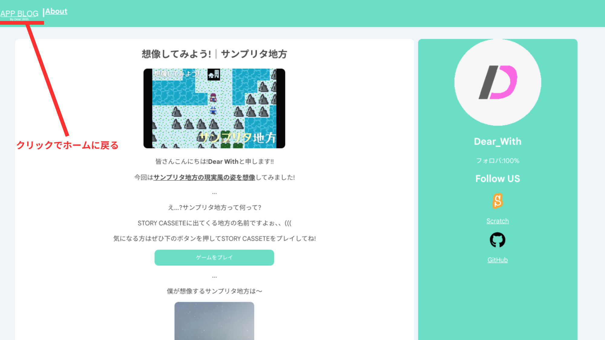

# APPBLOG
<h2>案内します! APP BLOG</h2>

皆さんこんにちは!<b>Dear With</b>と申します!!

今回は<b><u>APP BLOG</u></b>について案内したいと思います!

APP BLOGはDear_Withが書いたブログを集めたWebサイトです!

...あ! Daer_With BLOGとは関係ないのであまり気にしないでください!、、(試しに作っただけのサイト)

<h2>作業の裏側</h2>
<video controls src="作業の裏側.webm">
</video>

これは今ご覧になっているWebページを作っているシーンですね!

大変だったんですよ(((

<h3>ちなみに</h3>

ロゴをクリックをホームに戻ります

<h3>ということでブックマークよろしくね〜</h3>
